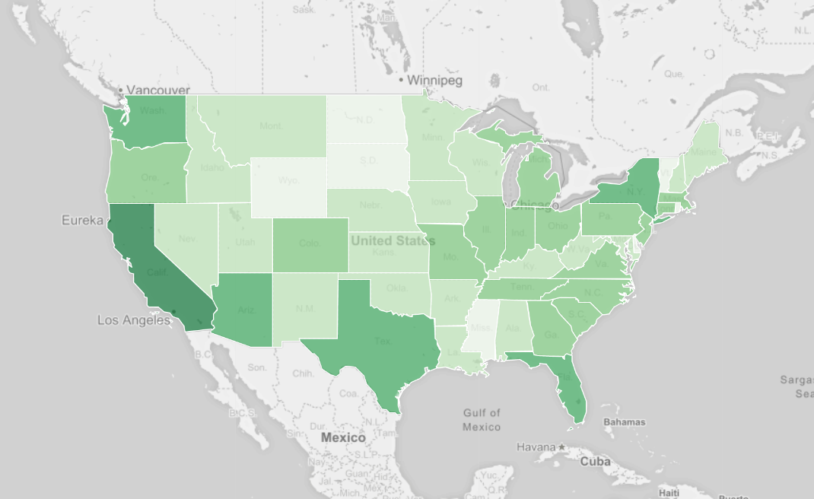

UFO
====



Ufo sighting by US state.

## Setup Python

Install dependencies:

```
virtualenv env
source env/bin/activate
pip install -r requirements.txt
```

## Setup the Database

Start docker:

```
docker run --publish=5984:5984 -e COUCHDB_USER=admin -e COUCHDB_PASSWORD=ufologie couchdb
```

Get the [backup script couchdb-dump]( https://github.com/danielebailo/couchdb-dump ) to import.
And the backup [ufo_couchdb.json](https://drive.google.com/open?id=1JA9A5RDlqdZ7Qe_Gxm8HiLUPdS_wleeO) file.

```
bash couchdb-backup.sh -r -H 127.0.0.1 -c -d ufo -f ufo_couchdb.json -u admin -p ufologie
```

Go to [http://localhost:5984/_utils/#_config/nonode@nohost](http://localhost:5984/_utils/#_config/nonode@nohost) and search for `reduce_limit` and set it to `false`.

## Ready to go!

Just run `python client.py` to get a list with ufo sightings by us state.

## Import Data

Instead of using the database dump it is possible to
import data from a csv file. But be aware this takes
at least on my setup around 3-4 hours.

The csv should use `;` as seperator.

To import just run `python import.py`.

